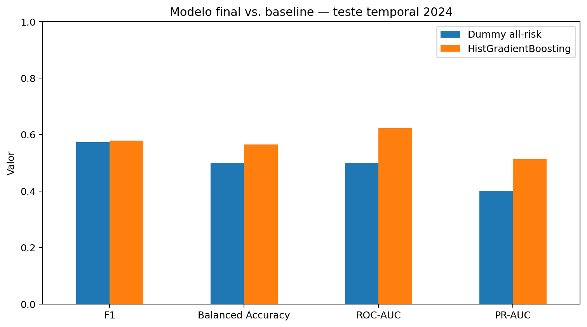
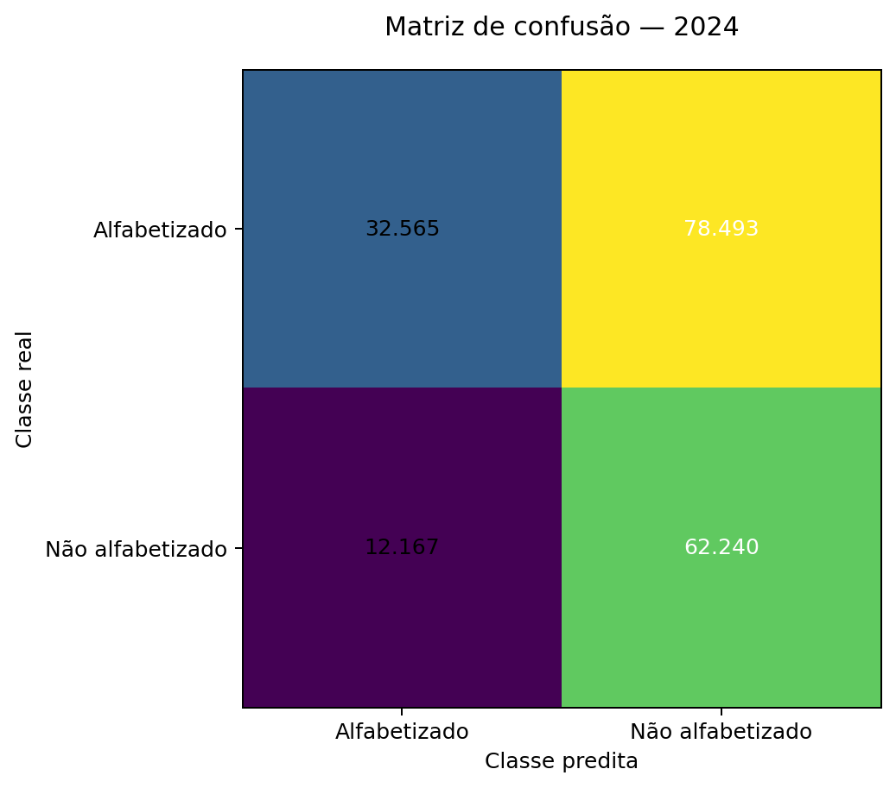
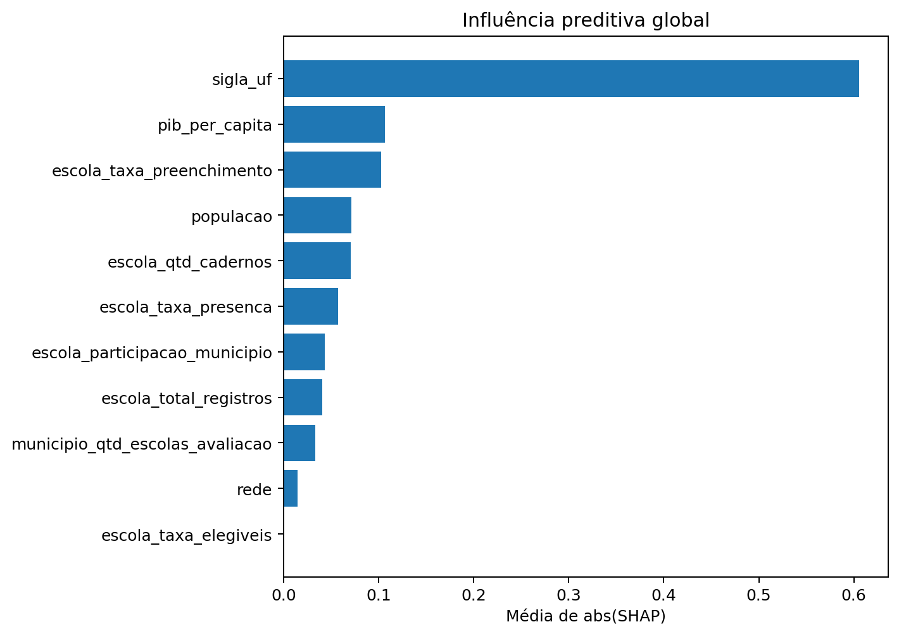

# Tech Challenge — Fase 3
## Predição e Inteligência Analítica para Alfabetização no Brasil

Projeto de Machine Learning supervisionado para classificação de risco de não
alfabetização e geração de inteligência territorial para apoio a políticas públicas.

## Links da entrega

- **Repositório Fase 3:** https://github.com/acorrea79/IASTTechChallengeFase3
- **Repositório Fase 2:** https://github.com/acorrea79/techchallenge-fase2-pipeline-alfabetizacao
- **Vídeo executivo:** adicionar após publicação

## Continuidade da Fase 2

A Fase 3 dá continuidade à arquitetura analítica da Fase 2.

Na execução final, essa continuidade não é apenas documental. O notebook principal:

1. clona o repositório da Fase 2;
2. importa `src/processing/gold_transform.py`;
3. executa a regra Gold `add_meta_reference()`;
4. materializa `phase2_gold_territorial.parquet`;
5. utiliza esse Parquet como entrada da análise prospectiva de metas.

As Golds territoriais da Fase 2 não substituem a base individual necessária ao
target supervisionado. Por isso, a Fase 3 constrói uma Gold ML adicional no nível
de registro de aluno, preservando as regras de elegibilidade e evitando leakage.

## Gold ML

Execução de referência:

- **335.551 registros**
- **19 colunas**
- nulos: **0**
- duplicados: **0**
- cobertura das features escolares operacionais: **100%**
- grupos município/rede com variação entre escolas: **67,15%**

A tentativa de integrar `id_escola` diretamente ao Censo Escolar de 2022 foi
auditada em uma amostra de 20 mil IDs e apresentou **0% de correspondência**.
A integração incompatível não foi forçada.

## Análise Exploratória de Dados

A EDA ocorre antes da modelagem e inclui:

- distribuição do target por ano;
- prevalência por rede, região e UF;
- distribuições e outliers das variáveis numéricas;
- correlações exploratórias;
- contexto escolar por classe;
- hipóteses para orientar a modelagem.

### Target

| Ano | Alfabetizado | Não alfabetizado |
|---:|---:|---:|
| 2023 | 58,28% | 41,72% |
| 2024 | 59,88% | 40,12% |

### Taxa de não alfabetização por região

| Região | 2023 | 2024 |
|---|---:|---:|
| Centro-Oeste | 41,42% | 35,81% |
| Nordeste | 45,53% | 42,85% |
| Norte | 48,75% | 49,18% |
| Sudeste | 40,89% | 37,61% |
| Sul | 32,33% | 38,94% |

O Norte apresenta a maior taxa nos dois anos, reforçando a hipótese de forte
componente territorial.

Mais detalhes: `reports/eda_reference.md`.

## Features do classificador

Territoriais e socioeconômicas:

- rede;
- UF;
- população;
- PIB per capita.

Contexto operacional da escola:

- quantidade de registros;
- taxa de presença;
- taxa de preenchimento;
- taxa de elegibilidade;
- quantidade de cadernos;
- quantidade de escolas avaliadas no município/rede;
- participação da escola no total municipal.

A saída é uma **classificação de risco em nível de registro de aluno baseada em
contexto escolar, territorial e socioeconômico**. Não é diagnóstico pedagógico individual.

## Estratégia de validação

- 2023: desenvolvimento, comparação, tuning e threshold;
- 2024: teste temporal final.

Modelos avaliados:

- DummyClassifier;
- Logistic Regression;
- Random Forest;
- HistGradientBoosting.

Modelo final: **HistGradientBoosting**  
Threshold: **0,31**

## Baseline vs. modelo final

| Métrica | Dummy all-risk | HistGradientBoosting |
|---|---:|---:|
| Accuracy | 0,4012 | **0,5112** |
| Balanced Accuracy | 0,5000 | **0,5649** |
| Precision | 0,4012 | **0,4423** |
| Recall | **1,0000** | 0,8365 |
| F1 | 0,5726 | **0,5786** |
| ROC-AUC | 0,5000 | **0,6225** |
| PR-AUC | 0,4012 | **0,5123** |



O ganho em F1 é pequeno (**+0,0060**). Os ganhos mais relevantes estão em:

- Balanced Accuracy: **+0,0649**
- PR-AUC: **+0,1111**

O valor principal da solução está em ordenar risco melhor que o baseline.

## Matriz de confusão

```text
TN = 32.565
FP = 78.493
FN = 12.167
TP = 62.240
```



## Interpretabilidade

Principais variáveis por média de abs(SHAP):

| Variável | Média de abs(SHAP) |
|---|---:|
| UF | 0,60583 |
| PIB per capita | 0,10648 |
| Taxa de preenchimento da escola | 0,10228 |
| População | 0,07126 |
| Quantidade de cadernos da escola | 0,07057 |
| Taxa de presença da escola | 0,05755 |



SHAP mede influência preditiva, não causalidade.

## Metas 2030 — análise prospectiva

A camada prospectiva consome a Gold territorial materializada a partir da
implementação da Fase 2.

A meta auditada para 2030 é **80%**.

Para cada município/rede:

```text
ritmo observado = taxa_2024 - taxa_2023

ritmo necessário =
(meta_2030 - taxa_2024) / 6

cenário tendencial 2030 =
taxa_2024 + 6 × ritmo observado
```

No cenário tendencial, **2.581** trajetórias aparecem em risco de não atingir 80% em 2030.
Após normalizar a chave de rede entre a Gold da Fase 2 e a base do modelo,
**2.531** dessas trajetórias possuem score preditivo e entram no ranking, com cobertura de **98,22%**.


Essa é uma análise prospectiva por cenário com apenas dois pontos anuais, não um
forecast formal de série temporal.

## Reprodutibilidade

Ambiente suportado: **Google Colab**.

O projeto utilizado para executar jobs BigQuery pode ser definido por:

```text
GCP_PROJECT_ID
```

ou:

```text
GOOGLE_CLOUD_PROJECT
```

Execute:

`notebooks/01_pipeline_end_to_end.ipynb`

O notebook gera Gold, EDA, CSVs, imagens, modelo e a camada territorial derivada
da Fase 2.

A execução de referência está consolidada em `reports/reference_execution.md` e nos
artefatos versionados deste repositório.

## Estrutura

```text
tech-challenge-fase3-predicao-alfabetizacao/
├── data/
│   └── phase2_gold/
├── notebooks/
├── src/
│   ├── preprocessing/
│   ├── modeling/
│   ├── evaluation/
│   └── visualization/
├── reports/
├── images/
├── requirements.txt
├── .gitignore
└── README.md
```

## Limitações

- features são majoritariamente contextuais;
- ganho de F1 sobre o baseline é pequeno;
- ROC-AUC é moderado;
- features escolares são contemporâneas ao ciclo da avaliação;
- o Censo Escolar não pôde ser integrado diretamente pela chave disponível;
- a projeção 2030 possui apenas dois pontos históricos;
- rankings com amostra pequena exigem cautela;
- SHAP não implica causalidade.

## Possíveis evoluções futuras

- obter tabela oficial de correspondência entre IDs de escola;
- incorporar variáveis pedagógicas individuais pré-avaliação sem leakage;
- usar contexto escolar de ano anterior com chave compatível;
- ampliar o histórico e avaliar modelos temporais formais;
- calibrar probabilidades;
- otimizar threshold por custo de política pública;
- avaliar fairness e estabilidade territorial;
- validar a solução em novos anos;
- disponibilizar painel de monitoramento.

## Documentação

- `reports/executive_summary.md`
- `reports/methodology.md`
- `reports/model_card.md`
- `reports/reference_execution.md`
- `reports/fase2_lineage.md`
- `reports/eda_reference.md`
- `reports/reproducibility.md`
- `reports/limitations_and_future_work.md`
